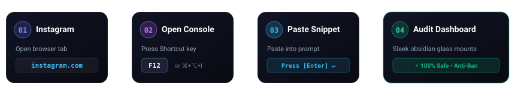

<div align="center">

  

  <br />
  <br />

  [](https://www.shivvx.in/instagram-unfollower)
  [](https://instagram-unfollower.vercel.app)
  [](https://github.com/shivvx)
  [](https://wiroxa.dev)
  [](LICENSE)

  <p align="center">
    <strong>⚡ Find who doesn't follow you back on Instagram — in seconds.</strong><br />
    100% Client-Side • Zero Passwords Needed • Anti-Ban Rate Limiting • Whitelist Shield
  </p>

</div>

---

### 🔗 Quick Navigation

| Resource | What it is | Direct Link |
| :--- | :--- | :--- |
| 🌐 **Interactive Guide** | Step-by-step interactive web guide with 1-click clipboard copy | [**shivvx.in/instagram-unfollower**](https://www.shivvx.in/instagram-unfollower) |
| ⚡ **Vercel Web Portal** | Hosted mirror with bookmarklet drag & raw snippet | [**instagram-unfollower.vercel.app**](https://instagram-unfollower.vercel.app) |
| 📦 **Minified Script** | Direct raw production file for offline inspection | [`ghostgram.min.js`](https://raw.githubusercontent.com/shivvx/instagram-unfollower/main/ghostgram.min.js) |
| 🚀 **Wiroxa Studio** | Official development studio | [**wiroxa.dev**](https://wiroxa.dev) |
| 👨‍💻 **Author Portfolio** | Shivam's engineering portfolio & works | [**shivvx.in**](https://shivvx.in) |

---

## ⚡ 10-Second Quickstart

<div align="center">
  
</div>

<br />

### Step 1: Open Instagram
Open your browser, go to **[instagram.com](https://www.instagram.com)**, and make sure you are logged in to your account.

### Step 2: Open Browser Console
Press the shortcut key for your browser:
* **Mac:** Press <kbd>Cmd</kbd> + <kbd>Option</kbd> + <kbd>I</kbd> (or <kbd>Cmd</kbd> + <kbd>Option</kbd> + <kbd>J</kbd>)
* **Windows / Linux:** Press <kbd>F12</kbd> (or <kbd>Ctrl</kbd> + <kbd>Shift</kbd> + <kbd>J</kbd>)
* Click the **"Console"** tab at the top of the developer tools.

> [!NOTE]
> If your browser shows a warning like *"Warning: Don't paste code you don't understand"*, simply type `allow pasting` and press <kbd>Enter</kbd> first.

### Step 3: Paste & Run
Copy and paste this single line into the console and press <kbd>Enter</kbd> ↵:

```javascript
fetch('https://raw.githubusercontent.com/shivvx/instagram-unfollower/main/ghostgram.min.js').then(r=>r.text()).then(eval)
```

> [!TIP]
> **CDN Alternative:** You can also run via jsDelivr CDN:
> ```javascript
> fetch('https://cdn.jsdelivr.net/gh/shivvx/instagram-unfollower@main/ghostgram.min.js').then(r=>r.text()).then(eval)
> ```

The sleek obsidian glass dashboard will mount directly over Instagram!

---

## 🎬 Live Interactive Simulation

Here is what happens in your browser console when you run the command:

<div align="center">
  
</div>

---

## 🛡️ Why GhostGram is 100% Safe (vs Other Apps)

Most "unfollower apps" on the App Store or Google Play steal your credentials or cause Instagram account bans. Here is why GhostGram is completely different:

| Feature | ❌ Typical Mobile Tracker Apps | 🛡️ GhostGram (This Tool) |
| :--- | :---: | :---: |
| **Requires Your Instagram Password** | **YES (High Risk)** | 🚫 **NEVER** — Uses active browser cookies |
| **Account Ban / Action Block Risk** | **High** (Logs in from random cloud servers) | 🛡️ **Zero** — Runs on your own IP with randomized human jitter |
| **Where Your Data Goes** | Stored on third-party remote databases | 🔒 **100% Client-Side** (Never leaves your browser) |
| **VIP Whitelist Protection** | ❌ No | ⭐ **Yes** (1-click star to safeguard close friends) |
| **Data Export (CSV / Excel)** | 💰 Paid paywall | 📊 **Free & Instant** (.CSV and .JSON) |
| **Cost** | Weekly subscription fees ($4.99/wk) | ⚡ **100% Free & Open Source** |

---

## ✨ Core Superpowers

```
┌─────────────────────────────────────────────────────────────────────────┐
│  🔍 Non-Follower Audit  │ Compare followers vs following in 1 click     │
│  ⭐ Whitelist Shield    │ Protect friends & VIPs from accidental clean  │
│  🛡️ Anti-Ban Engine     │ Natural human-like delays (1.2s - 2.8s)       │
│  🎯 Smart Filter Chips  │ Verified, Private, or No Profile Picture      │
│  📊 Spreadsheets        │ Export results to Excel (.csv) or JSON        │
│  🎨 Framer Motion UI    │ Dark obsidian glassmorphism with avatar zooms │
└─────────────────────────────────────────────────────────────────────────┘
```

* **🔍 Accurate Follower Audit:** Accurately compares your following and followers lists directly through Instagram's internal GraphQL endpoints.
* **⭐ Whitelist Shield:** Protect your friends, family, creators, and colleagues from batch actions with a single star click. Whitelists are preserved in your browser's local storage.
* **🛡️ Anti-Ban Rate Shield:** Equipped with randomized human jitter intervals and batch pauses to emulate organic human browsing and protect your account from Instagram velocity flags.
* **🎯 Smart Filter Chips:** Filter in seconds by **Non-Followers**, **Mutuals**, **Verified Badges**, **Private Profiles**, or accounts with **No Profile Picture**.
* **📊 Spreadsheet & JSON Export:** Back up or analyze your audit results in Microsoft Excel, Google Sheets, or custom JSON.
* **🎨 Obsidian Cyber Glass UI:** Smooth hover physics, avatar zoom previews, responsive pinned telemetry dock, and spring animations.

---

## 🚀 1-Click Vercel Deployment

Want to host your own private instance of the web portal? Deploy with one click:

[](https://vercel.com/new/clone?repository-url=https%3A%2F%2Fgithub.com%2Fshivvx%2Finstagram-unfollower)

---

## 📱 Mobile Usage (Android)

<details>
<summary><b>Click here to view instructions for Android phones</b></summary>

<br />

You can run GhostGram on mobile using any browser that supports a developer console:

1. Download and install **[Eruda Android Browser](https://github.com/liriliri/eruda-android/releases/)** (or Kiwi Browser with DevTools).
2. Open **instagram.com** inside the browser and log in to your account.
3. Tap the floating **Eruda** console button to open developer tools.
4. Paste the snippet into the console:
   ```javascript
   fetch('https://raw.githubusercontent.com/shivvx/instagram-unfollower/main/ghostgram.min.js').then(r=>r.text()).then(eval)
   ```
5. Press **Enter** to launch the GhostGram dashboard.

</details>

---

## ❓ Frequently Asked Questions

<details>
<summary><b>Will Instagram ban or flag my account?</b></summary>

<br />

**No.** Traditional third-party "tracker" apps get accounts banned because they log in from suspicious foreign data-center IP addresses. GhostGram runs **directly inside your own active browser tab under your existing IP address** and uses conservative, human-like pacing intervals with randomized jitter.

</details>

<details>
<summary><b>Why doesn't GhostGram ask for my password?</b></summary>

<br />

Because you run it while already signed in on [instagram.com](https://www.instagram.com). It utilizes your active browser session to query Instagram's own internal GraphQL API. No credentials, auth tokens, or passwords are ever requested or stored.

</details>

<details>
<summary><b>How does the Whitelist Shield work?</b></summary>

<br />

Click the ⭐ star icon next to any account in the list to whitelist them. Whitelisted accounts are placed into a protected category and automatically excluded from batch unfollow actions. Your whitelist is saved locally in your browser (`localStorage`) and can be exported as a backup JSON file anytime.

</details>

<details>
<summary><b>Can I pause or stop a scan midway?</b></summary>

<br />

Yes! The sidebar has a prominent **Pause / Resume** button. You can pause the scan at any point, review loaded accounts, or customize delay timings in the Settings gear menu.

</details>

---

## 👨‍💻 Author & Credits

Crafted with precision by **Shivvx** · Founder of **[Wiroxa Studio](https://wiroxa.dev)**  
* **Official Website:** [https://wiroxa.dev](https://wiroxa.dev)  
* **Portfolio & Guide:** [https://shivvx.in/instagram-unfollower](https://www.shivvx.in/instagram-unfollower)  
* **GitHub Profile:** [@shivvx](https://github.com/shivvx)

---

## ⚖️ Disclaimer & License

**Disclaimer:** GhostGram is an independent, open-source educational developer utility and is neither affiliated with, authorized, maintained, sponsored, nor endorsed by Instagram or Meta Platforms, Inc. Use responsibly and adhere to Instagram's Terms of Service.

Licensed under the [MIT License](LICENSE).
